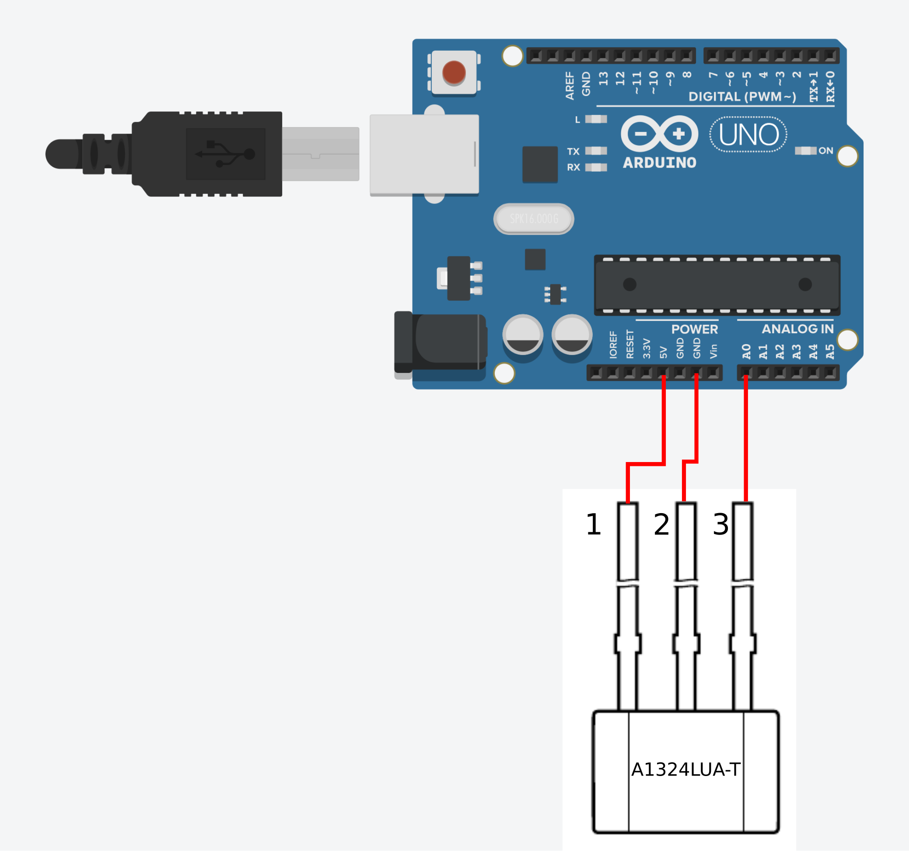
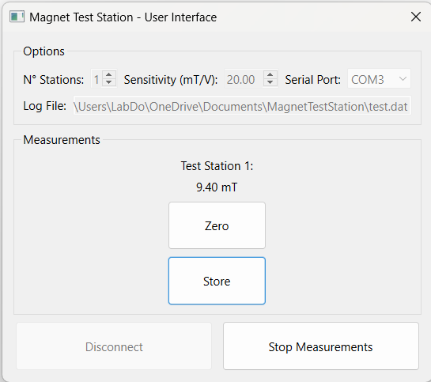
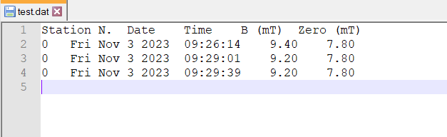

# Magnet Test Station

A test station for assessing the polarization of small permanent magnets and their correct magnetization 

## Required Material

- 1 Arduino UNO
	- alternatively any Arduino board provided with a USB interface, one Vcc and GND pin and one analog input pin
- 1 USB cable (to connect the Arduino board to the computer)
- 3 jumper cables (to connect the Hall sensor to the Arduino board)
- 1 A1324LUA-T Hall sensor
- 1 computer (with Windows or Linux)
- frame and spacer parts as provided in this repository (see [CAD models](./CAD-Model/) or the respective [release]() for STL exports); manufacturing them requires access to a 3D printer

**Software dependencies:**

Python 3 with the following libraries installed:

- PyQt6
- numpy
- pyserial

## Description

This repository contains:

- [CAD models](./CAD-Model/) of the frame and of different spacers
	- The following spacers are available:
		- **Spacer_A0**: Optimized for N52 12 x 12 x 12 mm<sup>3</sup> cubic permanent magnets
		- **Spacer_A1**: Optimized for N52 12 x 12 x 12 mm<sup>3</sup> cubic permanent magnets with a guide to the magnet at the centre
		- **Spacer_B0**: Optimized for N52 50 x 12 x 12 mm<sup>3</sup> permanent magnets with a magnetization alligned along one of the short sides
- [Python Scripts](./PythonScript/) to interface with the Arduino board
- [ArduinoScript](./ArduinoScript/), the code to be uploaded to the Arduino board

## Usage

1. Connect the Arduino board to a USB port
2. Prepare all the necessary connections. The following picture shows the connection of a single Hall sensor to the A0 analog pin of Arduino. Other Hall sensors can be connected to the other analog pins. At the present stage, the User Interface is designed to manage a maximum number of Hall sensors equal to four.\

3. Add the analog pin names to which the Hall sensors are connected into the short int array *pins* inside the Arduino sketch code `ArduinoScript/magnetTestStation.ino`
   ```cpp
   short pins[] = {A0};
   ```  
Upload the Arduino sketch into the Arduino board.
4. Run the Python script `mainInterface.py` in order to open the Main User Interface. Select the number of Hall sensor that have to be read, the sensors sensitivity, the Arduino board serial port and the log file name. Press the *Connect* button in order to establish a connection with the Arduino board. When ready, press the *Start Measurements* button to start the measuring process. During the measurement process, it is possible to store the measured data into the log file by pressing the *Store* button. Finally it is possible to set a zero by pressing the *Zero* button.\
\


## License and Liability

This is an open source hardware project licensed under the CERN Open Hardware Licence Version 2 - Weakly Reciprocal. For more information please check [CERN-OHL-W-2.0](LICENSES/CERN-OHL-W-2.0) and [DISCLAIMER](LICENSES/DISCLAIMER.pdf) in the [LICENSES](LICENSES/) folder.

The software source code in this repository is licensed under the  GNU General Public License Version 3. For more information please check [GPL-3.0-or-later](LICENSES/GPL-3.0-or-later) in the same folder.
